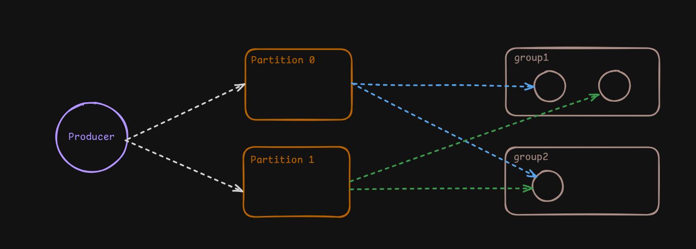

# Kafka Application

This project demonstrates the basic architecture of an event-driven application using Apache Kafka. It includes a producer that sends messages to a Kafka topic, which is partitioned across a cluster. Multiple consumer groups can subscribe to these messages, with each group handling the data according to its configuration. Kafka provides scalability by allowing data partitioning, and consumer groups enable horizontal scaling of message consumption.


This is how producer adds new messages to partitions and consumers gets the messages:



The application is containerized using Docker and can be easily deployed using Docker Compose. Below is a step-by-step guide to setting up and running the Kafka producer and consumers.


## Start Kafka, Producer and Consumers

Start Zookeper Container and expose PORT 2181. Start Kafka Container, expose PORT 9092 and setup ENV variables.

```bash
docker compose up -d
```

Run Multiple Consumers:
```bash
node consumer.js <GROUP_NAME>
```

Create Producer:
```bash
node producer.js
```


## Results

